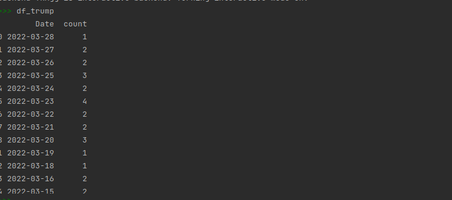

scripts:

appl.py, views.py, bot.py, scraping.py , templates: 
Flask application 

scraping_base.py:
       Web scraping from hotel bristol berlin

scraping_uspoliticians.py:

Plot the number of articles per day about Trump and Biden from:
https://www.theguardian.com/us-news/donaldtrump. 
Example:

<figure>
  

</figure>

Dataframe containing number of articles per day about Trump 

<figure>
  
</figure>