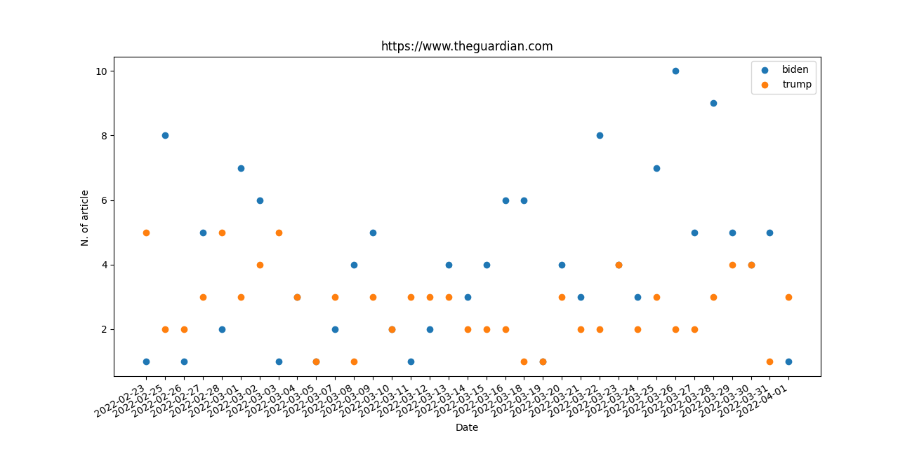

<!DOCTYPE html>
<html lang="en">
<head>
    <meta charset="UTF-8">
</head>
<body>
    <h1> Flask App</h1>
    

    
 Flask application displaying data from SQLite database. The database was created using data extracted from booking.com 

    <h2> Python Files </h2>
  <ul>
      <li>app.py</li>
      <li> bot.py </li>
      <li> HotelData.db</li>
      <li>pipeline.py </li>
      <li> scraping.py</li>
      <li > test_scraping.py</li>

  </ul>
    <h2> HTML Files</h2>
    <ul>
     <li> base.html</li>
      <li> add.html </li>
      <li> home.html</li>
    </ul>
   </ul>
    <h2> Database File</h2>
    <ul>
     <li> HotelData.db</li>
    </ul>
     <h3>Description</h3>
    
 Two routes were implemented so far : 

    <ul>
        <li> @app.route('/add/') : add new records into the database</li>
        <li> @app.route('/) : display records on the home page </li>
        <li> TO DO : route for displaying information like : "Which is the most reviewed hotel in the
        current database?"</li>
        <li> The HotelData.db file was generated  using three files
           bot.py, scraping.py, pipeline.py. Pipeline.py simply calls the method and class defined
            in scraping.py and bot.py, creates the database and loads the data. Data were extracted
            from booking.com </li>
        <li> Web Scraping limitation: the structure of website change frequently thus the files bot.py,
        scraping.py and pipeline.py will be modified accordingly. As of now, scraping.py no longer returns the
        expected outcome </li>
    </ul>
  <h1> Data collector </h1>
    

    
 Data extraction from https://www.theguardian.com and loading into a database . 

  
 <h2> Python Files </h2>
  <ul>
      <li>scraping_news.py</li>
      <li> Scraping_new.py</li>
  </ul>
      <h2> Database file</h2>
       <ul>
        <li> HotelData.db</li>
       </ul>
      <figure>
  
  <figcaption>Fig.1 - Plot the number of articles per day about Trump and Biden.</figcaption>
     </figure>

</body>

